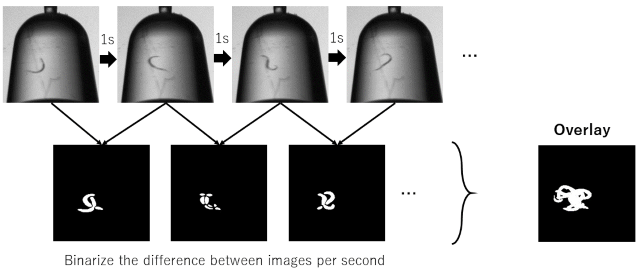
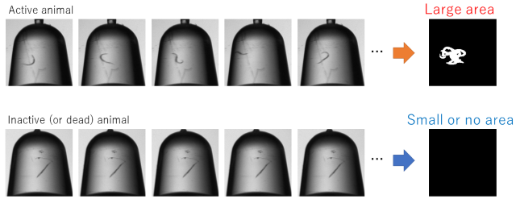

# ImageJ plugin for assessing animal activity
## Introduction
### Purpose
* Quantify and evaluate animal activity

### What's problem
* When assessing stress resistance or measuring longevity, it is difficult to confirm the death of animals without hearts, such as invertebrates and microorganisms. In some cases, even if they appear to be dead, they can suddenly revive when exposed to stimuli.  
 
* If there is no activity after repeated observation over a period of time, it is considered dead. But it is difficult to check with human eyes.  

### What this code does

* From the time-lapse images, the differences of each adjacent images are calculated.
Then, a binary stacked image of the differences during a given time period (i.e., 10 s) is generated.  
  

  
* Next, the areas of the pixels, whose values are 1 (255), in the stacked image are measured in each ROIs.  
By setting the threshold, the plugin indicates whether the animal(s) in each ROI are active or not.  
  

## Usage

## Citation
Not yet published.
