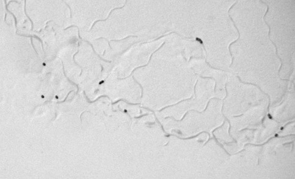
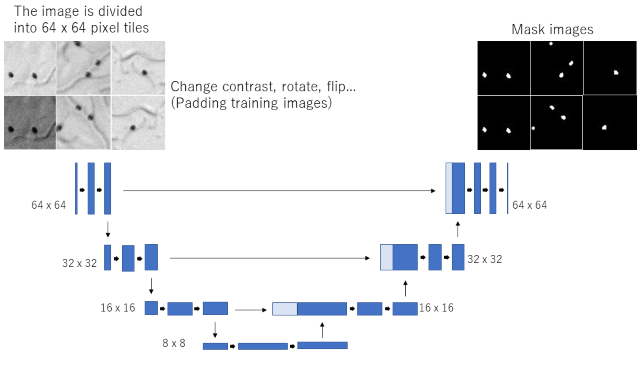
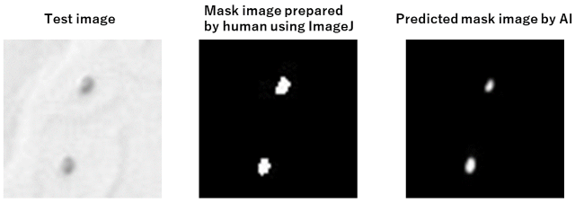
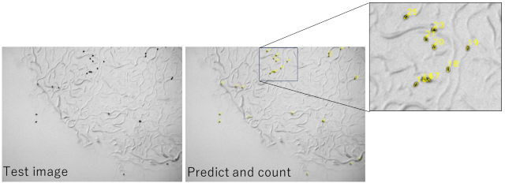

# Small object detection using UNET image segmentation

## Introduction
### Purpose
* #### Detection and counting of small organisms and eggs
ex. nematode eggs on a dish  

### What's problem
* #### Signs of movement and/or life activity of animals interfere with analysis.  
* #### When using highly magnified images that are sufficient to easily detect small objects, a large data set must be analyzed.
=> Researchers want to efficiently detect targets from as few images as possible!

### What this code does
* #### Detection of small objects by image segmentation using neural network (U-Net model)

* #### Pairs of images taken under the microscope and mask images that were generated by ImageJ are used for training

  
* #### Training images are padded by changing the contrast of the image, rotating, or flipping the image
* #### Training with U-net model using split images

* #### Test image is also split and objects are predicted

* #### Reconstruct the original size predicted mask images and count objects by OpenCV
* #### Overlay on the test image

## Usage

# Citation
Not yet published.
