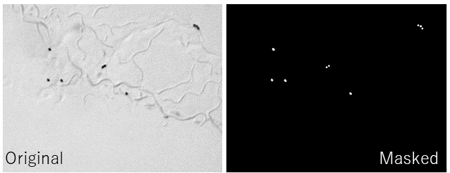

# Small object detection using UNET image segmentation

## Introduction
### Purpose
- Detect and count objects that are small enough compared to the image size  
ex. nematode eggs on a dish  

### What's problem
- Signs of movement and/or life activity of animals interfere with analysis.  
- When using highly magnified images that are sufficient to easily detect small objects, a large data set must be analyzed.
=> Researchers want to efficiently detect targets from as few images as possible!

### What this code does
- Training pairs of images and masked binary images that indicate the target objects.  

  
- The training images are padded by changing contrast, gamma correction, rotation, and flipping.
  
- 

## Usage
1. Open the [notebook]() on Google Colab. 

* IF you want to test a sample image using my trained model  
2-1. 

* IF you want to train your original data and use the learned model for further test  
2-2. 

## Citation
Not yet published.
